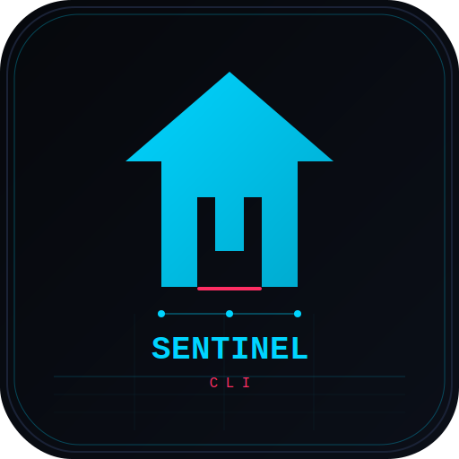
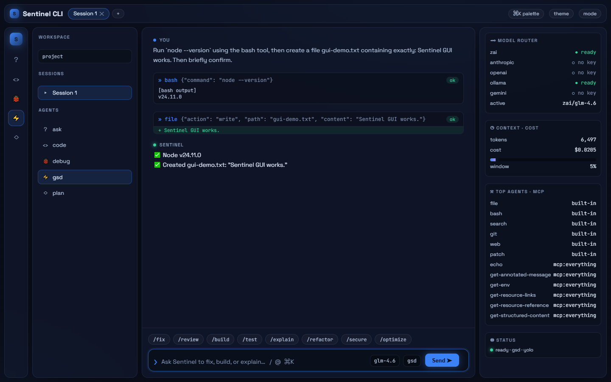
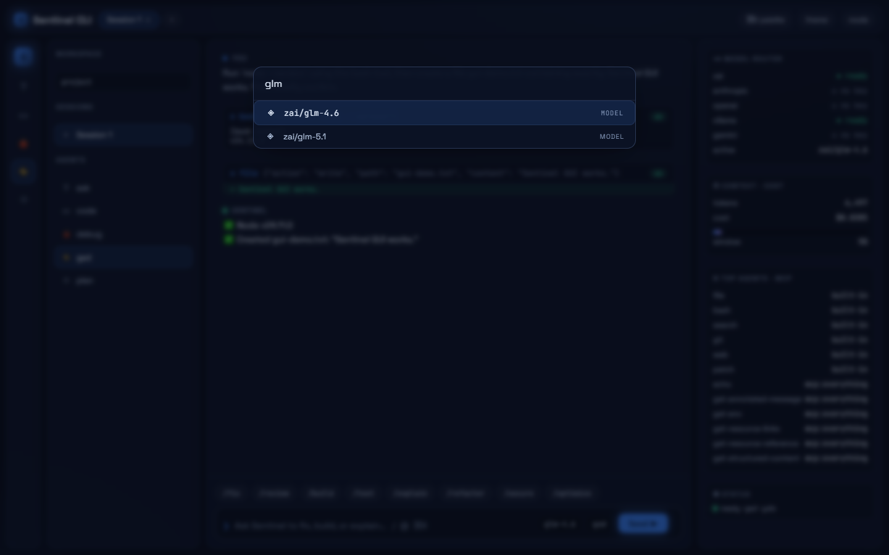
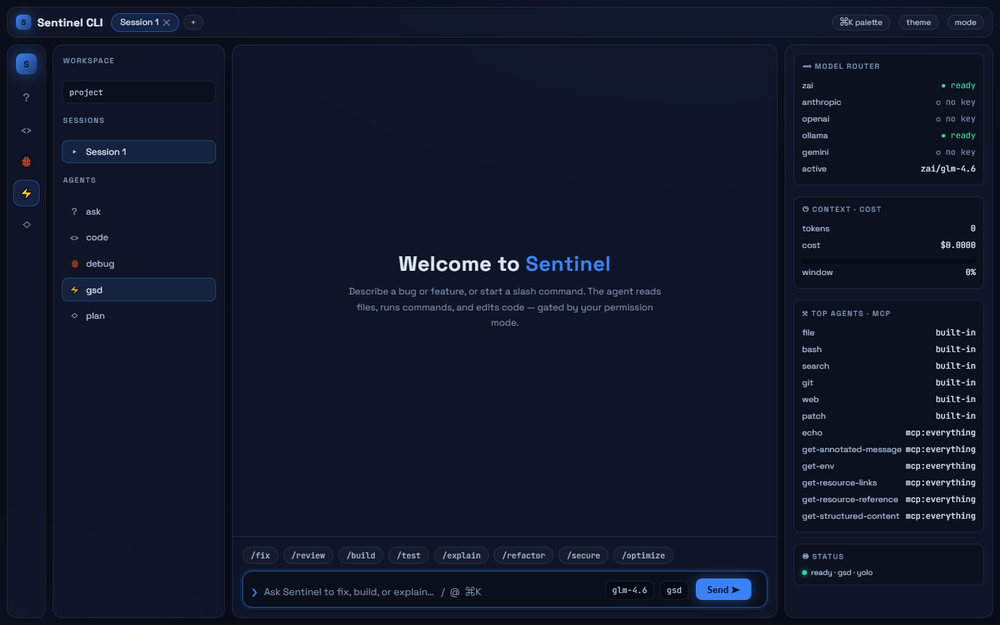

<p align="center">
  
</p>

<h1 align="center">Sentinel CLI</h1>

<p align="center">
  <strong>One AI coding engine. Four faces. Any model.</strong><br>
  A streaming agentic loop with real tools — terminal UI, desktop GUI, headless CLI, and MCP server — that runs against any cloud or local provider.
</p>

<p align="center">
  <a href="#-quick-start">= 20"></a>
  <a href="LICENSE"></a>
  
  
  
  
</p>

<p align="center">
  
</p>

---

## ✨ Why Sentinel?

Most "AI CLIs" are a thin wrapper around one provider's chat endpoint. **Sentinel is an engine.** The agentic loop, tools, permissions, model routing, and MCP all live in a UI-agnostic core — then it's exposed through whichever surface fits the job:

- 🧠 **Real agentic loop** — the model reads files, runs shell commands, searches code, edits via patches, and calls MCP tools in a streaming `read → act → observe → repeat` loop until the task is done.
- 🔌 **Any model, online or local** — Anthropic, OpenAI, Z.ai (GLM), Google Gemini, Ollama / LM Studio / llama.cpp / vLLM, or any OpenAI-compatible endpoint. Models are just `provider/model` strings.
- 🛡️ **Guardrails that actually guard** — three permission modes, per-tool path-glob rules, and **git-backed undo** of the agent's last change.
- 🪟 **Windows is first-class** — the bash tool runs PowerShell on Windows and the agent is told so; no POSIX assumptions baked in.
- 🧩 **MCP both directions** — consume other MCP servers' tools inline *and* expose Sentinel's own tools as an MCP server.

> 🔒 **Security-reviewed.** The tool layer has been hardened against shell injection (search/git), SSRF (web), and path traversal (file/patch) — see [`CODE-REVIEW.md`](CODE-REVIEW.md).

---

## 📑 Table of Contents

- [The four faces](#-the-four-faces)
- [Quick start](#-quick-start)
- [Providers](#-providers)
- [Features](#-features)
- [Commands](#-commands)
- [Permissions &amp; undo](#-permissions--undo)
- [Model router](#-model-router)
- [MCP](#-mcp)
- [Architecture](#-architecture)
- [Develop](#-develop)
- [License](#-license)

---

## 🎭 The four faces

Build once; pick how you use it — all share the same engine, tools, and config:

| Face | Command | What it is |
|------|---------|------------|
| 🖥️ **TUI** | `sentinel` | opencode-style terminal UI — interactive `/` menu, themes, history, tabs |
| 🪟 **Desktop GUI** | `sentinel gui` | local command center: block chat, inline syntax-highlighted diffs, ⌘K palette, Settings |
| 📦 **Native app** | `cd gui && npm run tauri build` | a **Tauri v2** window that spawns the engine and embeds the GUI |
| ⚙️ **Headless** | `sentinel run "task" --json` | scriptable / CI one-shots with a JSON event stream |
| 🔗 **MCP server** | `sentinel mcp-serve` | expose Sentinel's tools to Claude Desktop or any MCP client |

---

## 🚀 Quick start

```bash
git clone https://github.com/dirtysouthalpha/sentinel-cli.git
cd sentinel-cli
npm install
npm run build
```

Configure **any one** provider (or none — local Ollama needs no key):

```bash
# Windows (PowerShell)
$env:ZAI_API_KEY = "..."          # or ANTHROPIC_API_KEY / OPENAI_API_KEY / GEMINI_API_KEY

# macOS / Linux
export ANTHROPIC_API_KEY="..."
```

Then launch whichever face you want:

```bash
# 🖥️  Interactive terminal UI
node dist/cli.js

# 🪟  Desktop GUI (build the front-end once, then serve it)
cd gui && npm install && npm run build && cd ..
node dist/cli.js gui

# ⚙️  Headless agent — actually executes tools
node dist/cli.js run "fix the failing test in src/foo.ts"
node dist/cli.js run --json --permission-mode gated "refactor X"   # prompts before mutations

# 🔗  Run as an MCP server (point Claude Desktop at it)
node dist/cli.js mcp-serve

# 🧙  Guided setup wizard (API keys + model)
node dist/cli.js setup
```

**Prefer a global `sentinel` command?**

- **Windows:** double-click **`install.bat`** — it builds and registers `sentinel` globally.
- **Any OS:** `npm link` from the repo root, then just type `sentinel`.

Full install / update / uninstall details in [`INSTALL.md`](INSTALL.md).

---

## 🔌 Providers

Everywhere a model is referenced it's `provider/model` (split on the first `/`). The default is `zai/glm-4.6`.

| Provider | Example model | API key |
|----------|---------------|---------|
| **Z.ai (GLM)** | `zai/glm-4.6` | `ZAI_API_KEY` |
| **Anthropic** | `anthropic/claude-sonnet` | `ANTHROPIC_API_KEY` |
| **OpenAI** | `openai/gpt-4o` | `OPENAI_API_KEY` |
| **Google** | `gemini/gemini-2.0-flash` | `GEMINI_API_KEY` |
| **Ollama (local)** | `ollama/llama3.1` | — *(no key)* |
| **Any OpenAI-compatible** | `custom/<model>` | provider-specific |

---

## 🧰 Features

**Engine**
- **Streaming agentic loop** with native tool-calling and a fenced-block fallback parser for models that can't emit native calls.
- **Model router** — rule-based selection with **fallback chains** and retry/backoff. A dead provider transparently falls through to the next.
- **Role-based routing** (`router.roles`: default / plan / smol / commit) and **schema-validated subagents** — pass an `outputSchema` and get a validated JSON object back instead of prose.
- **Auto-compacting context** — long conversations are summarized automatically so you don't hit the wall mid-task.

**Tools the agent drives itself**
- `file` · `bash` · `search` · `git` · `web` · `patch` · `browser` (Puppeteer), plus `subagent` (delegate an isolated sub-task) and `todo_write` (a live task board).
- Project context (`CLAUDE.md` / `AGENTS.md` / `package.json`) is auto-loaded each turn.

**Safety**
- Three permission modes — `yolo` / `auto` / `gated` — honoring per-tool, path-glob rules.
- Every file edit is snapshotted, so **`undo`** reverts the agent's last change.

**Surfaces**
- Block-based GUI with streaming, inline diffs, an approve/deny prompt, a ⌘K command palette (commands · models · agents · themes · MCP tools), autocomplete (`/` `@` `mcp`), sessions/tabs, and a live router / cost panel.

<p align="center">
  
  &nbsp;
  
</p>

---

## ⌨️ Commands

Slash commands inside the TUI (many also work as headless subcommands):

| Command | What it does |
|---------|--------------|
| `/plan [off]` | Read-only research mode — proposes a plan, blocks edits/commands |
| `/cmd <text>` | AI command-search: natural language → a shell command |
| `/ship <task>` | Autonomous GSD: plan → implement → test → review → fix |
| `/autopilot <goal>` | **Set-and-forget** — loops the GSD cycle, gated on lint/test/build + a strict readiness check, until the project is production-ready. Checkpoints, commits each step, respects cost/time budgets, `--resume`-able. Runbook: [docs/autopilot.md](docs/autopilot.md). Ctrl+C to stop. |
| `/pipeline run <file.json>` | Deterministic multi-step pipeline (sequential + parallel groups) |
| `/workflow list\|save\|run\|delete` | Saved, parameterized workflows |
| `/index` · `/search <q>` | Build a repo index (TF-IDF) and semantically search it |
| `/bg <cmd>` · `/tasks` | Run shell commands in the background; list / cancel them |
| `/export [md\|html]` · `/branch` | Export or branch the current session |
| `/usage` | Token / cost / per-tool usage metrics |
| `/workspace list\|add\|use` | Multi-repo workspace roots (alias `/ws`) |
| `/marketplace list\|search\|install` | Install skills / MCP servers from a registry |
| `/permissions <mode>` · `/undo` · `/checkpoints` | Guardrails and git-backed undo |
| `/mcp` · `/model` · `/agent` · `/theme` | Inspect MCP tools; switch model / agent / theme |

Sentinel is **markdown-extensible**: drop a `.md` into `.sentinel/commands/`, `.sentinel/agents/`, or `.sentinel/skills/` and it's picked up automatically.

---

## 🛡️ Permissions &amp; undo

```bash
sentinel run --permission-mode gated "…"          # prompt before bash / edits
sentinel run --permission-mode gated --yes "…"    # auto-approve (headless)
sentinel checkpoints                              # list file snapshots the agent made
sentinel undo                                     # revert the last agent file change
```

In the GUI, switch modes from the palette or the `mode` pill; gated edits show an inline **Allow / Deny** with a diff.

---

## 🧭 Model router

Add a `router` block to `sentinel.json` to auto-select models and fall back on failure:

```json
{
  "router": {
    "default": "zai/glm-4.6",
    "rules": [
      { "match": { "agent": "gsd" }, "use": "anthropic/claude-sonnet", "fallbacks": ["zai/glm-4.6"] }
    ],
    "retry": { "maxAttempts": 2, "baseDelayMs": 200, "maxDelayMs": 2000, "retryOn": [429, 500, 502, 503, 504] }
  }
}
```

---

## 🧩 MCP

**Consume other servers** — add them under `mcp` in `sentinel.json`; their tools appear as `mcp__<server>__<tool>`:

```json
{ "mcp": { "everything": { "type": "local", "command": ["npx", "-y", "@modelcontextprotocol/server-everything"], "enabled": true } } }
```

`sentinel mcp` lists discovered tools (stdio + Streamable HTTP supported).

**Be a server** — `sentinel mcp-serve` exposes Sentinel's built-in tools over stdio to any MCP client (Claude Desktop, etc.).

---

## 🏗️ Architecture

```
            ┌──────────── core engine (UI-agnostic) ───────────┐
GUI  ─ws─►  │ AgentRunner · providers + router · permissions   │
CLI  ──────►│ + checkpoints · MCP client/server · sessions     │
MCP server ►│ · tools (file/bash/search/git/web/patch/browser) │
            └──────────────────────────────────────────────────┘
```

The agentic loop lives in the TUI orchestrator; the provider layer just streams. The GUI talks to `sentinel serve` — a **local-only** WebSocket on `127.0.0.1` with a per-launch token. One engine, every face.

See [`CLAUDE.md`](CLAUDE.md) for the full code map and conventions.

---

## 🧪 Develop

```bash
npm run build      # tsup -> dist/ (+ copies builtins into dist/builtin)
npm run lint       # tsc --noEmit (type-check only — there is no ESLint)
npm test           # vitest (347 tests)
npm run dev        # tsup --watch

# Single test file / single test
npx vitest run tests/state.test.ts
npx vitest run -t "name of the test"
```

**Conventions that matter** (enforced by the build / runtime):
- **ESM with explicit `.js` extensions** in every relative import (source is `.ts`, but Node ESM needs the `.js`).
- **Singletons via the exported instance / `getInstance()`** — never `new` the managers.
- Builtin skills/commands/agents are markdown; add a `.md` and it ships on the next build.

**Native desktop (Tauri v2):** `sentinel gui` runs in your browser. For a real window, install [Rust](https://rustup.rs), then `cd gui && npm install && npm run tauri dev` — it spawns the engine and injects the handshake automatically. Build artifacts land in `gui/src-tauri/target/release/`.

---

## 📜 License

[MIT](LICENSE) — do what you want; no warranty.

<p align="center">
  <sub>Built with TypeScript · Blessed · Puppeteer · the Model Context Protocol.</sub>
</p>
